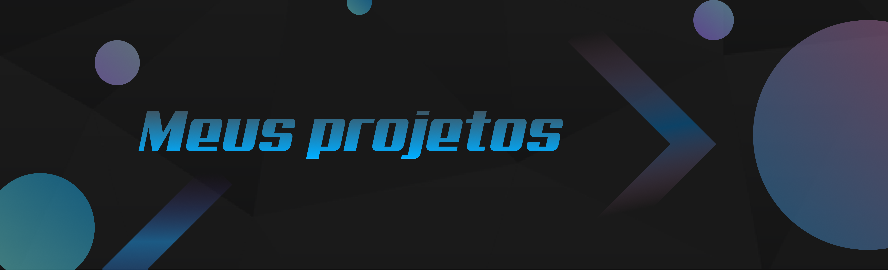

## Alguns projetos...

- **Chat realtime**

  > Chat em tempo real com socket.io

  > [Visualizar repositório](./chat%20realtime/)

---

- **Cronômetro**

  > Cronometro feito com HTML, CSS e Javascript

  > [Visualizar repositório](./Cronometro/)

---

- **Recriando a interface do Netflix - DIO**

  > Recriando a interface do principal site de streaming mundial utilizando tecnologias simples como HTML5, CSS3 e Javascript.

  > [Visualizar repositório](./Recriando%20a%20Interface%20do%20Netflix/)

---

- **Recriando a página inicial do Instagram - DIO**

  > Recriando a página de login do Instagram usando CSS com Flexbox.

  > [Visualizar repositório](./Recriando%20a%20p%C3%A1gina%20inicial%20do%20Instagram/)

---

- **Recriando o jogo da cobrinha com Javascript - DIO**

  > Clássico jogo da cobrinha utilizando HTML, CSS e Javascript.

  > [Visualizar repositório](./Recriando%20o%20jogo%20da%20cobrinha%20com%20JavaScript/)
